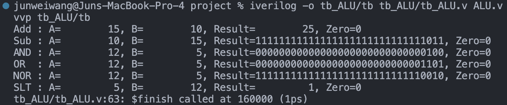
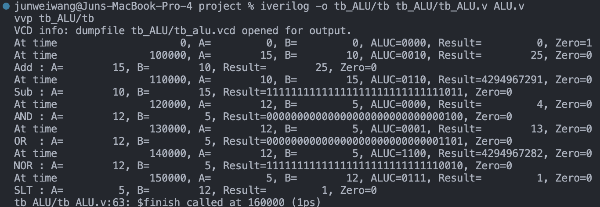
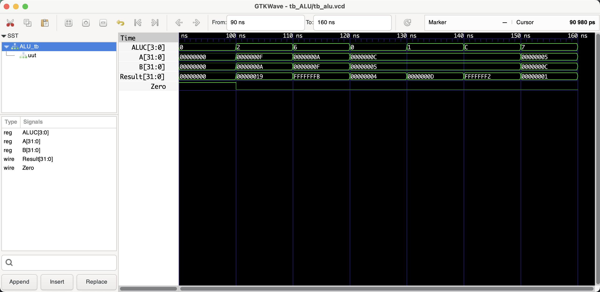

# ALU

```shell
iverilog -o tb_ALU/tb tb_ALU/tb_ALU.v ALU.v
vvp tb_ALU/tb

# open gtkwave to view the waveform
gtkwave tb_ALU/tb_alu.vcd &
```

## Benchmark (verifying the correctness)

### Shell




### Waveform



## Documentation

Here's the documentation for the `ALU` Verilog module:

### Module Declaration:
```verilog
module ALU (A, B, ALUC, Zero, Result);
```
This line declares the module's name `ALU` and specifies its interface, which consists of two 32-bit data inputs (`A` and `B`), a 4-bit ALU control input (`ALUC`), a zero flag output (`Zero`), and a 32-bit result output (`Result`).

### Port Definitions:
- `input [31:0] A;`: A 32-bit input representing the first operand for the ALU operations.
- `input [31:0] B;`: A 32-bit input representing the second operand for the ALU operations.
- `input [3:0] ALUC;`: A 4-bit ALU control input that determines the operation to be performed on the operands.
- `output reg[31:0] Result;`: A 32-bit register that holds the result of the ALU operation.
- `output Zero;`: A single-bit output that is high (1) if the result is zero and low (0) otherwise.

### Functionality:
The `ALU` module performs various arithmetic, logical, and comparison operations based on the `ALUC` control code. Here's what each part does:

- **Arithmetic Operations**:
  - **Add (ALUC 0010)**: Adds the two operands (`A + B`).
  - **Subtract (ALUC 0110)**: Subtracts the second operand from the first (`A - B`).

- **Logical Operations**:
  - **AND (ALUC 0000)**: Performs a bitwise AND on the operands (`A & B`).
  - **OR (ALUC 0001)**: Performs a bitwise OR on the operands (`A | B`).
  - **NOR (ALUC 1100)**: Performs a bitwise NOR on the operands (`~(A | B)`).

- **Comparison Operations**:
  - **Set on Less Than (ALUC 0111)**: Sets the result to 1 if the first operand is less than the second operand; otherwise, sets to 0 (`A < B ? 1 : 0`).

- **Zero Flag**: The `Zero` output is high when the result is 0, providing a quick way to check for a zero result, which is useful for branch and other conditional instructions.

### Behavioral Description:
The module uses a combinational always block triggered by changes in any input (`A`, `B`, or `ALUC`). Inside the block, a case statement selects the appropriate operation based on the `ALUC` control code. The result of the operation is assigned to the `Result` output, and the `Zero` flag is updated accordingly.

### Usage:
The `ALU` is a central component in the MIPS CPU, performing calculations required by various instructions. The ALU's operation is controlled by the control unit, which sets the `ALUC` based on the current instruction's opcode and function fields.

### Testing and Verification:
- Ensure each operation is correctly implemented by applying appropriate test vectors, as shown in the testbench.
- Check the `Zero` flag for correct behavior, especially for corner cases like zero and negative results.

### Conclusion:
The `ALU` module is a fundamental part of the MIPS CPU architecture, providing the necessary computational capabilities. Its design must be efficient and reliable to ensure accurate and fast execution of instructions. Proper documentation and testing are crucial for maintaining and extending the ALU's functionality.