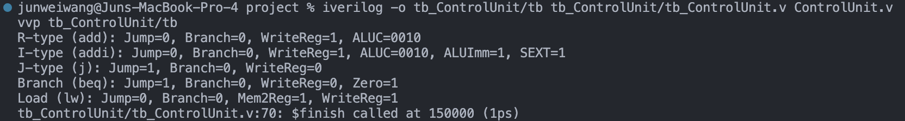
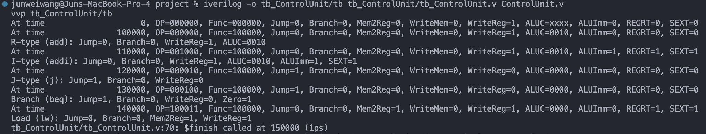
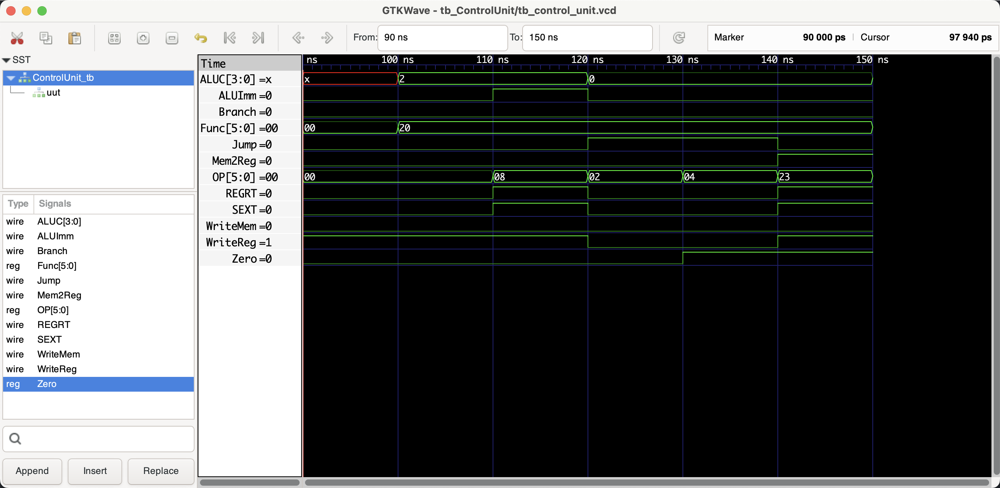

# Control Unit

```shell
iverilog -o tb_ControlUnit/tb tb_ControlUnit/tb_ControlUnit.v ControlUnit.v
vvp tb_ControlUnit/tb

# open gtkwave to view the waveform
gtkwave tb_ControlUnit/tb_control_unit.vcd &
```

## Benchmark (verifying the correctness)

### Shell output




### Waveform



## Documentation

### Module Declaration:
```verilog
module ControlUnit (
  Zero, OP, Func,
  Jump, Branch,
  Mem2Reg, WriteMem, WriteReg,
  ALUC, ALUImm,
  Shift,
  REGRT, SEXT
);
```
This line declares the module's name `ControlUnit` and specifies its interface, which consists of inputs for the zero flag, opcode, and function code, as well as outputs for various control signals used throughout the MIPS CPU.

### Port Definitions:
- `input Zero;`: A signal indicating if the result of the last ALU operation was zero. It's used primarily for branch instructions.
- `input [5:0] OP;`: The 6-bit opcode from the instruction. It's used to determine the type of instruction (R-type, I-type, or J-type) and the corresponding operations.
- `input [5:0] Func;`: The 6-bit function code used for R-type instructions to determine the specific operation (like add, subtract, etc.).
- `output reg Jump, Branch;`: Control signals indicating whether the current instruction is a jump or branch.
- `output reg Mem2Reg, WriteMem, WriteReg;`: Control signals for memory access and register writing. `Mem2Reg` indicates if the data should come from memory (for load instructions), `WriteMem` indicates if memory should be written to (for store instructions), and `WriteReg` indicates if the register file should be written to.
- `output reg [3:0] ALUC;`: The 4-bit ALU control signal specifying the operation to be performed by the ALU.
- `output reg ALUImm;`: A signal indicating if the ALU should use the immediate value from the instruction (`1`) or a value from a register (`0`).
- `output REGRT, SEXT;`: `REGRT` is a control signal indicating if the result should be written to the `rt` field (`1`) or `rd` field (`0`) of the instruction. `SEXT` indicates if immediate values should be sign-extended (`1`) or zero-extended (`0`).

### Functional Description:
The `ControlUnit` is responsible for interpreting the current instruction and setting various control signals that dictate the behavior of other components in the MIPS CPU. Here's how it functions:

- **Opcode and Function Code Interpretation**: The control unit uses the `OP` and `Func` inputs to determine the type of the current instruction and its requirements. Based on this, it sets the control signals accordingly.
- **Setting Control Signals**: Each control signal (`Jump`, `Branch`, `Mem2Reg`, etc.) is set based on the type and needs of the current instruction. These signals control whether data is read from or written to memory, how the ALU operates, where results are saved, and more.

### Usage:
The `ControlUnit` is a critical component in the MIPS CPU, as it essentially acts as the "brain" of the CPU, interpreting instructions and coordinating the actions of other parts. It's used in every cycle of instruction execution to ensure the correct operations are performed.

### Testing and Verification:
- Ensure the control unit sets the correct signals for a variety of instruction types.
- Check that R-type, I-type, and J-type instructions all produce the expected control signals.
- Verify that the control signals correctly handle edge cases, like NOP instructions.

### Conclusion:
The `ControlUnit` module is central to the functioning of a MIPS CPU. It ensures that each instruction is executed correctly by setting various control signals that guide the operation of the CPU's other components. Proper documentation, testing, and verification are crucial for ensuring that the control unit functions correctly and reliably under all possible instruction scenarios.