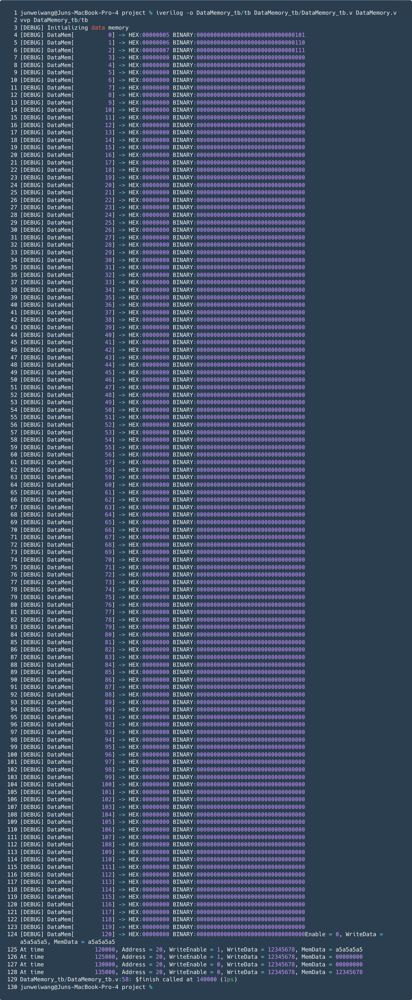
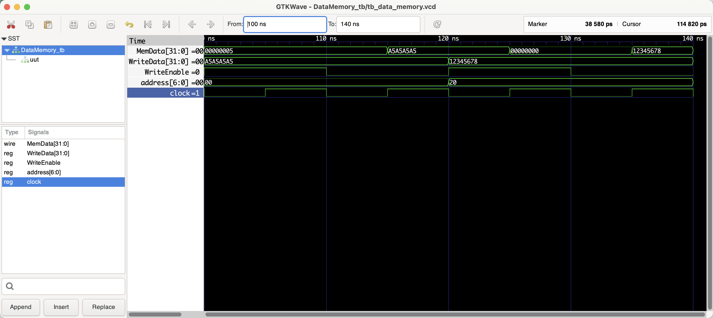

# DataMemory

```shell
iverilog -o tb_DataMemory/tb tb_DataMemory/tb_DataMemory.v DataMemory.v
vvp tb_DataMemory/tb

# open gtkwave to view the waveform
gtkwave tb_DataMemory/tb_data_memory.vcd &
```

## Benchmark (verifying the correctness)

### Shell output



### Waveform



## Documentation

### Module Declaration:
```verilog
module DataMemory (clock, address, WriteEnable, WriteData, MemData);
```
This line declares the module's name `DataMemory` and specifies its interface, which consists of a clock input, an address input, a write enable signal, a data input for writing, and a data output for reading.

### Port Definitions:
- `input clock;`: The clock signal input. Memory operations are synchronized with the positive edge of this clock.
- `input WriteEnable;`: A signal that controls whether data should be written to the memory. When high (1), the module will perform a write operation.
- `input [6:0] address;`: A 7-bit address input that specifies the memory address where data should be read from or written to. Only the upper 5 bits (`[6:2]`) are used to index memory, as explained in the comments within the module.
- `input [31:0] WriteData;`: A 32-bit input that contains the data to be written into the memory location specified by the address input when write operations are enabled.
- `output reg [31:0] MemData;`: A 32-bit register that stores the data read from the memory at the specified address.

### Memory Declaration:
```verilog
reg [31:0] Mem[0:127]; //32 bits memory with 128 entries
```
This line declares a 128-entry array of 32-bit registers, representing the memory. Each entry corresponds to a word of memory.

### Initialization:
The initial block sets all memory entries to 0 and then initializes the first three locations with specific values. It also includes debug messages to display the initial state of the memory.

### Functional Description:
- **Write Operation**: On the positive edge of the clock, if `WriteEnable` is high, the module writes the value from `WriteData` into the memory location specified by the upper 5 bits of the `address` input.

- **Read Operation**: On the positive edge of the clock, irrespective of the `WriteEnable` signal, the module updates the `MemData` output with the value from the memory location specified by the upper 5 bits of the `address` input.

### Addressing Explanation:
The module uses `address[6:2]` to index the memory array. This technique reflects word-aligned memory addressing commonly used in 32-bit systems. By using only the upper 5 bits of the 7-bit address, the module effectively addresses memory in 4-byte (32-bit) increments, which is consistent with the word size of the memory.

### Overall Functionality:
The `DataMemory` module simulates a simple RAM-like memory block in a digital system. It responds to a clock signal for synchronized read and write operations. The memory can be written to when the `WriteEnable` signal is high. It continually provides the data at the current address on the `MemData` output, allowing for data to be read every clock cycle.

### Example Usage:
This module could be used in a CPU design as part of the data path, where it would serve as the main data memory, storing and providing access to operands, intermediate results, and other data necessary for program execution. The ability to selectively write or read based on the `WriteEnable` signal allows for versatile memory operation within larger system architectures.