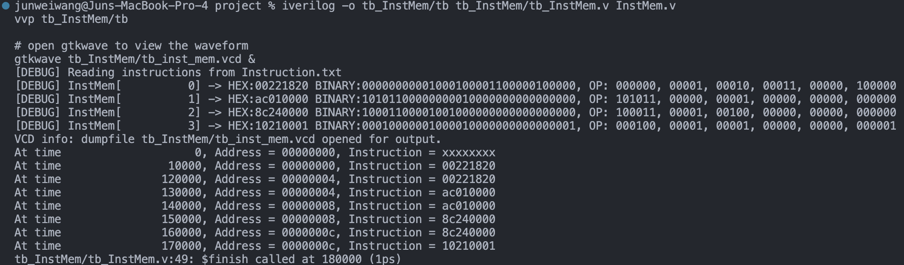
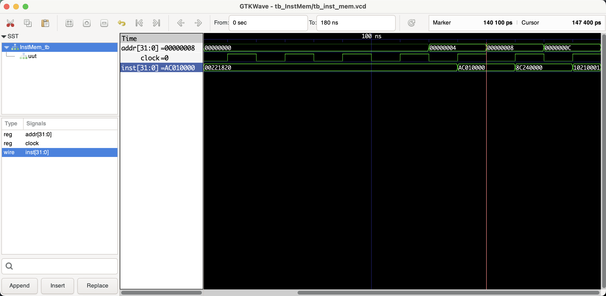

# InstMem (Instruction Memory)

```shell
iverilog -o tb_InstMem/tb tb_InstMem/tb_InstMem.v InstMem.v
vvp tb_InstMem/tb

# open gtkwave to view the waveform
gtkwave tb_InstMem/tb_inst_mem.vcd &
```

## Benchmark (verifying the correctness)

### Shell output



### Waveform



## Documentation

### Module Declaration:
```verilog
module InstMem(clock, addr, inst);
```
This line declares the module's name `InstMem` and specifies its interface, which consists of a clock input, an address input, and an instruction output.

### Port Definitions:
- `input clock;`: The clock signal input. It synchronizes the reading of instructions from memory.
- `input [31:0] addr;`: A 32-bit address input that specifies the memory address from which the instruction should be read.
- `output reg [31:0] inst;`: A 32-bit register that holds the instruction read from the specified address.

### Memory Declaration:
```verilog
reg [31:0] Mem [0:127];
```
This line declares a 128-entry array of 32-bit registers, representing the instruction memory. Each entry corresponds to a word of memory where instructions are stored.

### Initialization:
The initial block uses `$readmemh` to read a set of predefined instructions from a file named "Instruction.txt" into the instruction memory. It then iterates through the initialized memory locations and prints their contents for debugging purposes.

### Functional Description:
- **Memory Reading**: On the positive edge of the clock, the module updates the `inst` output with the value from the memory location specified by the upper bits of the `addr` input (word-aligned by using `addr[31:2]`).

### Word-Aligned Addressing:
- The module uses `addr[31:2]` to index the memory array. This reflects word-aligned memory addressing, commonly used in 32-bit systems. By using only the upper bits of the 32-bit address, the module effectively addresses memory in 4-byte (32-bit) increments, which is consistent with the word size of the memory.

### Overall Functionality:
The `InstMem` module simulates the instruction memory of a MIPS CPU. It responds to a clock signal for synchronized read operations. The memory can be read from any given address, and it provides the instruction stored at that address through the `inst` output. The module is essential in a CPU design as it holds the sequence of instructions that the CPU will execute.

### Debugging and Initialization:
- The module includes a debug message that prints out the contents of the memory after initialization. This feature is helpful for verifying that the instructions are loaded correctly and for understanding how the module behaves during simulation.

### Example Usage:
In a MIPS CPU architecture, this module would serve as the instruction memory where all the executable instructions are stored. The CPU fetches instructions from this memory sequentially or based on branch and jump instructions, which provide the addresses. The `InstMem` module provides a critical function in the fetch stage of the CPU pipeline.

### Conclusion:
The `InstMem` module is a fundamental component in a MIPS CPU simulation, representing the instruction memory from which instructions are fetched during the execution of a program. Its design and functionality ensure that instructions are available to the CPU in a synchronized and orderly manner, consistent with the MIPS architecture and the requirements of a single-cycle or multi-cycle processing model.