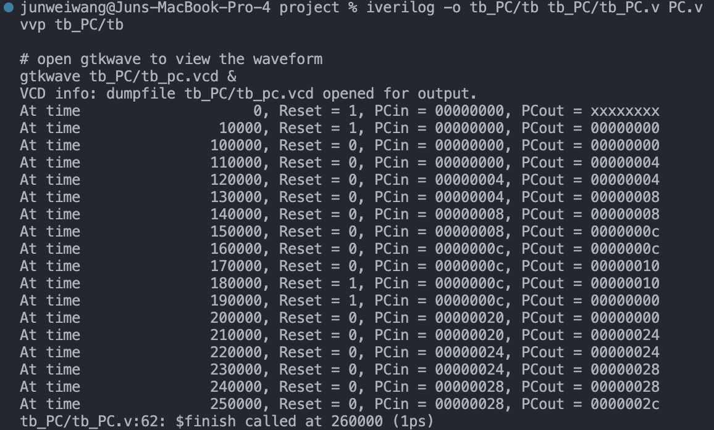
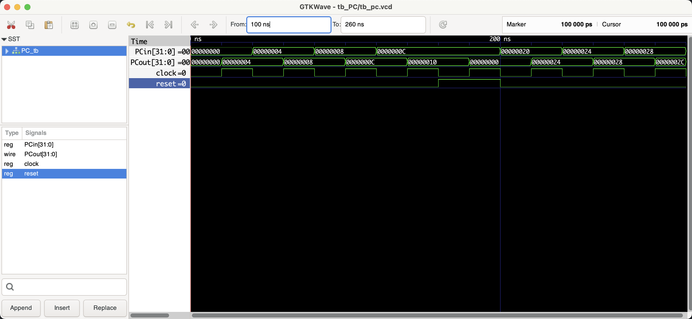

# PC (Program Counter)

```shell
iverilog -o tb_PC/tb tb_PC/tb_PC.v PC.v
vvp tb_PC/tb

# open gtkwave to view the waveform
gtkwave tb_PC/tb_pc.vcd &
```

## Benchmark (verifying the correctness)

### Shell output



### Waveform



## Documentation

### Module Declaration:
```verilog
module PC (clock, reset, PCin, PCout);
```
This line declares the module's name `PC` and specifies its interface, which consists of a clock input, a reset input, a 32-bit input for the next program counter value (`PCin`), and a 32-bit output for the current program counter value (`PCout`).

### Port Definitions:
- `input clock;`: The clock signal input. It synchronizes the updating of the program counter.
- `input reset;`: A signal to reset the program counter. When high, it sets the program counter to 0.
- `input [31:0] PCin;`: A 32-bit input that specifies the next value of the program counter. Typically, it's the address of the next instruction to execute.
- `output reg [31:0] PCout;`: A 32-bit register that holds the current value of the program counter, representing the address of the current instruction.

### Functional Description:
The `PC` module is responsible for holding and updating the address of the current instruction that the processor is executing. Here's what each part does:

- **Reset Behavior**: On the positive edge of the clock, if the `reset` signal is high, the `PCout` register is set to 0. This resets the program counter, typically used at the start of the program or during some error handling.

- **Incrementing**: If the `reset` is not asserted, the program counter is updated to `PCin + 4` on each positive edge of the clock. This prepares the processor to fetch the next instruction in sequence.

### Incrementing by 4:
The comment explains why the program counter is incremented by 4 bytes:
- MIPS architecture uses fixed-length 32-bit instructions, which equates to 4 bytes.
- Memory is byte-addressable, so to get the address of the next instruction, you need to add 4 to the current address.

### Usage:
The `PC` module is a critical component in the MIPS CPU architecture, determining the sequence of instruction execution. It's connected to other parts of the CPU, such as:
- The instruction memory, which uses `PCout` to fetch the current instruction.
- The control logic or sequential logic that determines the next value of `PCin`, whether it's a sequential increment for most instructions, the target of a jump or branch, or the result of an exception.

### Testing and Verification:
- Ensure the program counter correctly resets to 0 when the `reset` signal is asserted.
- Verify the program counter increments correctly by 4 under normal operation and can be set to a specific address via `PCin` when jumping or branching.

### Conclusion:
The `PC` module is a fundamental part of the MIPS CPU, driving the sequential execution of instructions. It must be carefully synchronized with the rest of the system to ensure correct and efficient fetching and execution of instructions. Proper documentation and testing are crucial for maintaining and understanding this component's role within the larger CPU architecture.