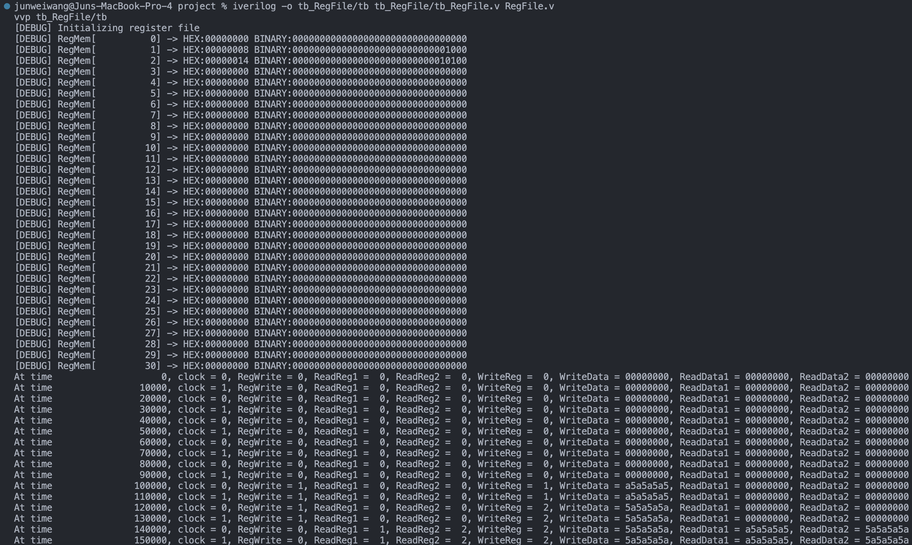
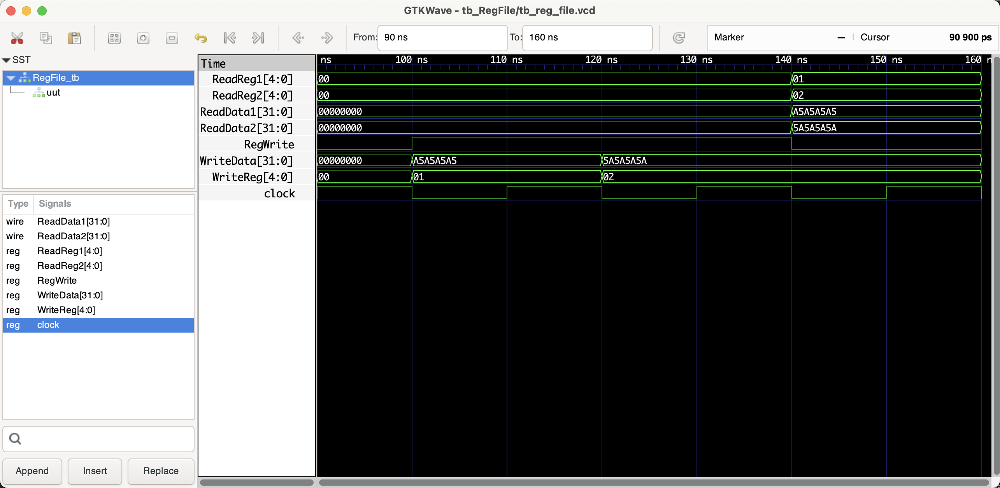

# PC (Program Counter)

```shell
iverilog -o tb_RegFile/tb tb_RegFile/tb_RegFile.v RegFile.v
vvp tb_RegFile/tb

# open gtkwave to view the waveform
gtkwave tb_RegFile/tb_reg_file.vcd &
```

## Benchmark (verifying the correctness)

### Shell output



### Waveform



## Documentation

### Module Declaration:
```verilog
module RegFile (
  clock, WriteEnable,   
  ReadReg1, ReadReg2,   
  WriteReg, WriteData,  
  ReadData1, ReadData2  
);
```
This line declares the module's name `RegFile` and specifies its interface, which consists of inputs for the clock, write enable, register addresses, and data to write, as well as outputs for the data read from the registers.

### Port Definitions:
- `input clock;`: The clock signal input. It synchronizes the writing of data to the registers.
- `input RegWrite;`: A signal indicating if writing to a register is enabled (1 for enabled, 0 for disabled).
- `input [4:0] ReadReg1, ReadReg2;`: 5-bit inputs specifying which registers to read from.
- `input [4:0] WriteReg;`: A 5-bit input specifying which register to write to.
- `input [31:0] WriteData;`: A 32-bit input specifying the data to be written into the register specified by `WriteReg`.
- `output [31:0] ReadData1, ReadData2;`: 32-bit outputs providing the data read from the registers specified by `ReadReg1` and `ReadReg2`.

### Register Array:
```verilog
reg [31:0] reg_mem [0:31];
```
This line declares a 32-element array of 32-bit registers, representing the register file in a MIPS CPU. Each element corresponds to one of the MIPS architecture's 32 general-purpose registers.

### Initialization:
The initial block sets all register values to 0 and then assigns some random initial values for demonstration purposes. It also includes debug messages to display the initial state of the register file.

### Reading Registers:
The `ReadData1` and `ReadData2` outputs are continuously assigned the values of `reg_mem[ReadReg1]` and `reg_mem[ReadReg2]`, respectively. This means that they always reflect the current contents of the specified registers.

### Writing to Registers:
The always block is triggered on the rising edge of the clock. If `RegWrite` is enabled, it writes the value of `WriteData` into the register specified by `WriteReg`.

### Usage:
The `RegFile` module is a fundamental component in the MIPS CPU, providing the necessary mechanism for storing and accessing the CPU's general-purpose registers. It's used in nearly every instruction to read operand values and write results.

### Testing and Verification:
- Ensure the register file correctly returns the stored values for any specified registers.
- Verify that writing to a register updates its value only when `RegWrite` is enabled and the clock is triggered.
- Check that the register file maintains its state correctly over multiple read and write operations.

### Conclusion:
The `RegFile` module is an essential part of the MIPS CPU architecture, serving as the primary storage for the processor's working data. Its design must be efficient and reliable to ensure accurate and fast access to register values. Proper documentation and testing are crucial for maintaining and understanding this component's role within the larger CPU architecture.