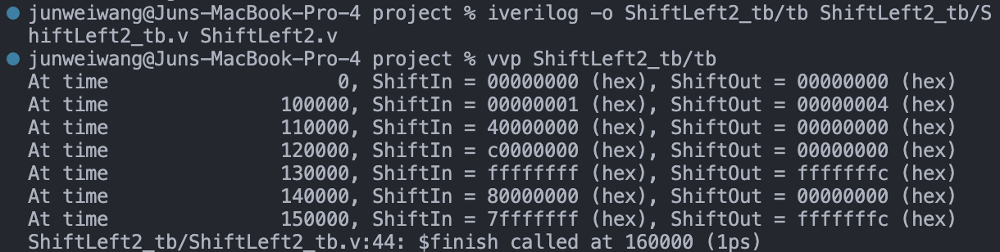
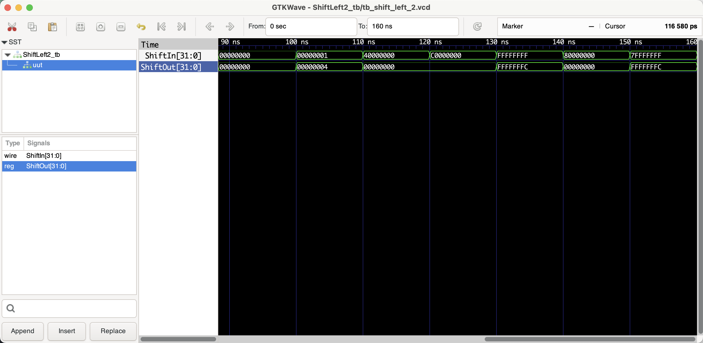

# ShiftLeft2

```shell
iverilog -o tb_ShiftLeft2/tb tb_ShiftLeft2/ShiftLeft2_tb.v ShiftLeft2.v
vvp tb_ShiftLeft2/tb

# open gtkwave to view the waveform
gtkwave tb_ShiftLeft2/tb_shift_left_2.vcd &
```

## Benchmark (verifying the correctness)

### Shell output



### Waveform



## Documentation

The Verilog module named `ShiftLeft2` is designed to perform a left bit-shift operation by two positions on a 32-bit input. Here's a detailed documentation of this module:

### Module Declaration:
```verilog
module ShiftLeft2 (ShiftIn, ShiftOut);
```
This line declares the module's name `ShiftLeft2` and specifies its interface, which consists of two ports: `ShiftIn` (the input) and `ShiftOut` (the output).

### Port Definitions:
```verilog
input [31:0] ShiftIn;
output reg [31:0] ShiftOut;
```
- `input [31:0] ShiftIn;`: This line declares a 32-bit wide input port named `ShiftIn`. The range `[31:0]` indicates that `ShiftIn` is a vector containing 32 bits, indexed from 31 (the most significant bit) down to 0 (the least significant bit).

- `output reg [31:0] ShiftOut;`: This line declares a 32-bit wide output port named `ShiftOut`. Unlike `ShiftIn`, `ShiftOut` is declared with the `reg` keyword, indicating that it is a register-type storage element. This is necessary because `ShiftOut` will be driven by procedural assignments inside an `always` block.

### Procedural Block:
```verilog
always @(ShiftIn) begin
	ShiftOut = ShiftIn << 2;
end
```
- `always @(ShiftIn) begin ... end`: This is an `always` block that triggers whenever there is a change in the `ShiftIn` signal. The sensitivity list of the block is specified by `@(ShiftIn)`, making the block sensitive to changes in `ShiftIn` only.

- `ShiftOut = ShiftIn << 2;`: Inside the `always` block, the `ShiftOut` register is assigned the value of `ShiftIn` shifted left by two positions. The left shift operation (`<<`) moves all the bits in `ShiftIn` to the left by two bit-positions. Zeros are filled into the least significant bits as a result of the shift. The most significant two bits of `ShiftIn` are effectively discarded.

### Overall Functionality:
The `ShiftLeft2` module monitors the `ShiftIn` input. When `ShiftIn` changes, the module shifts this input value two bits to the left and outputs the result on `ShiftOut`. This kind of operation is often used in hardware algorithms that require multiplication by powers of 2 (since shifting left by one bit position is equivalent to multiplying by 2), or when aligning data in certain ways, such as address manipulation or data packing.

### Example Usage:
This module could be used in a larger system that requires data alignment or rapid multiplication by four. Since the module only reacts to changes in `ShiftIn`, it's a combinational logic circuit despite using the `reg` keyword for the output. This is a common pattern in Verilog for creating combinational logic that requires procedural assignments.