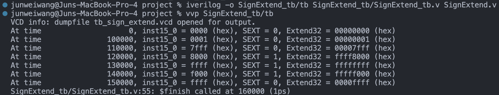
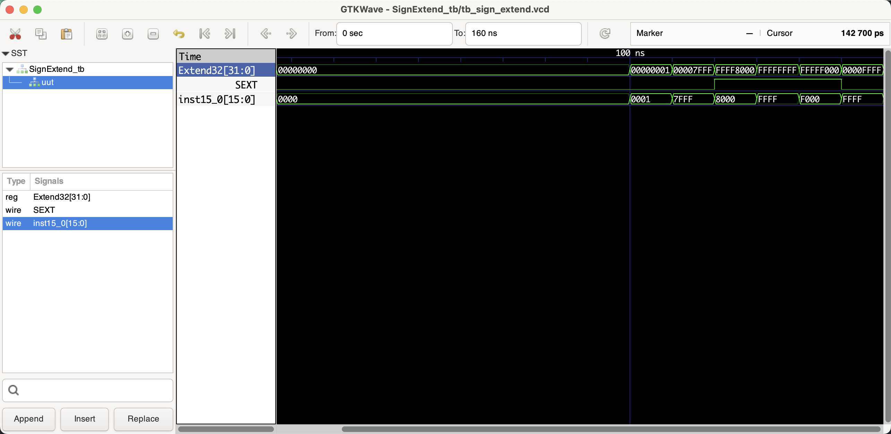

# Sign Extend

```shell
iverilog -o tb_SignExtend/tb tb_SignExtend/tb_SignExtend.v SignExtend.v
vvp tb_SignExtend/tb

# open gtkwave to view the waveform
gtkwave tb_SignExtend/tb_sign_extend.vcd &
```

## Benchmark (verifying the correctness)

### Shell output



### Waveform



## Documentation

### Module Declaration:
```verilog
module SignExtend (inst15_0, SEXT, Extend32);
```
This line declares the module's name `SignExtend` and specifies its interface, which consists of one 16-bit input (`inst15_0`), one control input (`SEXT`), and one 32-bit output (`Extend32`).

### Port Definitions:
- `input [15:0] inst15_0;`: A 16-bit input vector that represents the value to be extended.

- `input SEXT;`: A single-bit input signal that determines the mode of extension. When `SEXT` is high (logic 1), the module performs sign extension; when `SEXT` is low (logic 0), the module performs zero extension.

- `output reg [31:0] Extend32;`: A 32-bit register output vector that holds the extended result of `inst15_0`.

### Procedural Block:
```verilog
always @(inst15_0 or SEXT) begin
    if (SEXT) begin
        // Sign extension logic
        Extend32[31:16] <= {16{inst15_0[15]}};
        Extend32[15:0] <= inst15_0;
    end else begin
        // Zero extension logic
        Extend32[31:16] <= 16'h0000;
        Extend32[15:0] <= inst15_0;
    end
end
```
- `always @(inst15_0 or SEXT) begin ... end`: An `always` block that is sensitive to changes in either `inst15_0` or `SEXT`. Whenever a change is detected in these signals, the code within the block will execute.

- `if (SEXT) begin ... end else begin ... end`: A conditional statement within the `always` block that checks the value of `SEXT`. Depending on the value of `SEXT`, it performs one of two actions:

  - **Sign Extension**: If `SEXT` is high, the module replicates the sign bit (bit 15) of `inst15_0` across the upper 16 bits of `Extend32`. This preserves the sign of the input value when extended to 32 bits, which is essential for representing negative numbers correctly in two's complement notation.
  
  - **Zero Extension**: If `SEXT` is low, the module sets the upper 16 bits of `Extend32` to 0. This effectively pads the input value with zeros, which is used for unsigned numbers where the sign does not need to be preserved.

### Overall Functionality:
The `SignExtend` module takes a 16-bit input and extends it to a 32-bit output based on the mode selected by `SEXT`. Sign extension is used to preserve the sign of signed numbers when converting them to a larger bit width, while zero extension is used when the input is considered an unsigned number. This module is commonly used in instruction decoding stages of processors, where immediate values from instructions need to be extended to the processor's word size.

### Example Usage:
In a CPU architecture where instructions may contain 16-bit immediate values that need to be used in a 32-bit context, this module would be used to extend those immediate values appropriately, based on whether they are to be treated as signed or unsigned quantities.